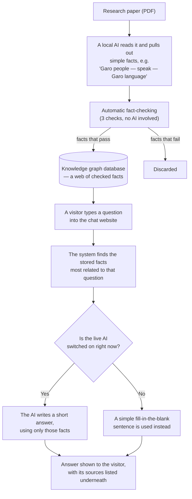

# Handover Document — P85 Mandi/Garo Knowledge Graph & Chatbot

*Last updated: 7 October 2026. Written for a reader with no computing, database or AI background.*

## 1. What this is

This is the **P85 Mandi Climate Knowledge Graph project** (Swinburne University). Research about the Mandi/Garo Indigenous community of Bangladesh — their climate knowledge, language, culture and daily challenges — exists scattered across academic papers that most people will never read. This project builds an automatic, step-by-step process that reads those papers once, pulls out individual facts, checks each one before trusting it, stores the checked facts in a searchable database, and lets anyone ask a chatbot plain-language questions and get an answer built only from facts that have been verified against the original wording — with the source shown alongside every answer. It is aimed at the project's supervisor and stakeholders now, with the longer-term aim of being a tool the Mandi/Garo community and researchers could use directly.

## 2. How it works, step by step

1. **A research paper goes in.** A PDF about the Mandi/Garo community is fed to a program that reads its text page by page.
2. **A local AI pulls out facts.** An **LLM** (Large Language Model — the kind of AI, like the one behind ChatGPT, that has been trained on huge amounts of text and can read and write natural language) reads chunks of the paper and writes down simple fact statements, such as "Garo Community — faces — Unemployment". This AI runs on the team's own computer using a free tool called **Ollama**, which lets an AI model run directly on an ordinary computer instead of a company's cloud service — the project made a commitment to its university supervisor that paper content never leaves local infrastructure.
3. **Every fact is automatically checked before it's trusted.** Three independent checks run with no AI involved, each one a plain computer program comparing text:
   - **Well-formedness** — is the fact written sensibly (not a garbled fragment)?
   - **Grounding** — do the words in the fact actually appear in the sentence it claims to be quoting?
   - **Quote-genuineness** — does that quoted sentence genuinely exist, word for word, on that page of the original PDF?
   A fact that fails any check is thrown away, not flagged for someone to review later. The project deliberately chose this strict approach: a wrong fact reaching a visitor directly was judged worse than a missing one.
4. **Surviving facts go into a knowledge graph.** A **knowledge graph** is a way of storing facts as a connected web rather than rows in a spreadsheet — think of index cards pinned to a board with string connecting related ones ("Garo Community" — string labelled "faces" — "Unemployment"), rather than a table. This project uses **Neo4j AuraDB**, an off-the-shelf cloud product built for exactly this kind of storage.
5. **A visitor asks a question.** On the chat website, a visitor types a question in plain English.
6. **The system searches the web of facts for relevant ones.** It looks for facts whose words relate to the words in the question, and ranks them so the most relevant ones come first.
7. **An answer is written — one of two ways:**
   - **If the live AI is switched on:** this is **RAG** (Retrieval-Augmented Generation) — instead of letting the AI answer from general knowledge (where it could easily make something up, called "hallucinating"), the system hands it only the specific facts found in step 6 and tells it to answer using only those. This keeps answers tied to checked, real information.
   - **If the live AI is switched off** (its normal resting state — see Section 5): a simpler, automatic fill-in-the-blank sentence is built directly from the facts instead. It's less fluent but still accurate.
8. **The answer is shown with its sources.** Every answer comes with an expandable list of the exact facts and page numbers it was built from, so a visitor can check the system's working.

A separate, smaller path lets an administrator upload a brand-new paper. It is automatically scored by the same local AI for suitability (is it credible, relevant, and does it handle Indigenous knowledge ethically?) before anyone decides whether to extract facts from it — see Section 4 for what is and isn't automatic here.

## 3. The parts of the system

The right-hand column points to the **repository** — the online project folder (hosted on a service called **GitHub**) that holds every file and the full history of changes. A reader does not need to open it to follow this document; it is there for whoever picks this project up next.

| Component | What it does (plain English) | Technology used | Where it lives in the repository |
|---|---|---|---|
| PDF reader & fact extractor | Reads a research paper and writes down simple fact statements | Ollama (running the `deepseek-r1` AI model) + a PDF text-reading tool | `main.py`, `kg_extractor.py` |
| Fact-checking gates | Automatically verifies every extracted fact before it's trusted (see step 3 above) | Plain computer code, no AI involved | `verification/` |
| Subject-correction step | Automatically rewrites a fact's subject when its source sentence names something more specific than the generic community | A grammar-analysis tool (no AI) | `subject_specificity.py` |
| Knowledge graph database | Stores the checked facts as a searchable connected web | Neo4j AuraDB (cloud database product) | `neo4j_loader/`, `config.py` |
| Paper-admission scoring | Scores a newly uploaded paper on credibility, relevance and ethical handling before extraction | Ollama (local AI) + rule-based checks | `confidence_framework.py`, `admin_ingest.py` |
| Chat/answer server | Finds facts relevant to a question and either asks the AI to write an answer or builds a fallback one. This is the project's **API** — the fixed way the chat website asks for, and receives, an answer | A small web-serving program + Ollama | `rag.py` |
| Chat website | What a visitor actually sees, types into, and reads answers from | Flutter (a toolkit for building one app that runs as a website, and could also be built for phones) | `flutter_application/` |
| Hosting | Where the website and chat server live on the public internet | Render (a cloud hosting service) | `Dockerfile.serve`, `scripts/` |
| Remote link to the AI | Lets the hosted website reach the AI model, which runs on a team laptop rather than in the cloud | Tailscale Funnel (a secure internet tunnel) + a small guard program that checks a password before forwarding anything | `ollama_tunnel_proxy.py`, `scripts/tunnel_on.sh`, `scripts/tunnel_off.sh` |

## 4. Current state

### Working, and verified

- The full extraction pipeline has processed 3 real papers about the Garo community, producing **45 checked facts** out of **578 candidate facts** the AI originally proposed — about 1 in 13 survived the fact-checking gates.
- The knowledge graph is live in the cloud database, and the chat website answers real questions from it. Both the website and the chat server are live on the public internet right now.
- An automated test suite exists and passes: **298 backend checks** and **60 website checks**, re-run before each change is shipped.
- The admin screen for uploading a paper, seeing its automatic suitability score, and manually approving or rejecting borderline ones has been built and demonstrated live.
- Two demo logins exist — a visitor account and an administrator account — each seeing a different part of the website.
- English and Hindi are both available as the website's display language.
- A "read the answer aloud" (text-to-speech) feature and a "speak your question" (speech-to-text) feature exist in the website.

### Partially working

- **Live, freshly-written AI answers** only work while a team laptop is switched on and connected (see Section 5) — this is off by default, so most of the time visitors get the simpler fallback-style answer for any question outside three pre-written examples.
- **Paper-admission scoring** can distinguish an irrelevant paper from a relevant one, but scoring the *same* paper repeatedly has produced very different results from one run to the next (documented in Section 5).
- **The list of sources shown under an answer** is capped to a reasonable number, but is not perfectly limited to only the facts the written answer actually used — it can include a few facts that were available but not mentioned.

### Not built

- **Automatic end-to-end paper intake.** An administrator can approve a newly uploaded paper, but nothing automatically extracts facts from it afterwards — a person still has to run that step by hand. A single paper takes roughly **1.2 hours** of local AI processing time to extract.
- **Feedback storage.** Visitors can mark an answer helpful or not, but that feedback is only remembered on their own device and goes nowhere else — it is lost if they clear their browser, and no one on the team can currently see it.
- **A real account/permission system.** The two demo logins are fixed values built into the published website, not individually issued accounts — anyone who inspects the website's code can find them.
- **An automatic check that a paper is licensed or permitted to be used.** The ethical-handling score (see Section 2, step on paper admission) checks whether a paper's *authors* documented ethical consent from *their* research participants — it does not check whether this project itself has permission to use the paper.
- **A pipeline for the project's second data-handling commitment** — that human-collected material such as workshop transcripts or interviews would also stay on the local AI only. No such data has gone through the system yet, and no dedicated intake path for it exists.

## 5. Limitations

| Limitation | Why it matters to a non-technical reader | Impact |
|---|---|---|
| **Small knowledge base.** Only 45 facts, from 3 papers, are currently loaded. | The chatbot can only answer what those 45 facts cover. Many reasonable questions about the Garo community will get an honest "I don't know" rather than a wrong guess. | **High** |
| **Strict trust filter reduces how much gets answered.** The system is built to discard any fact it cannot verify, even at the cost of knowing less overall. | This is a deliberate safety choice — a wrong fact was judged worse than a missing one — but it means the chatbot will decline more questions than a less careful system would. | **Medium** (intentional tradeoff) |
| **One known data-quality issue.** A population figure in the data (1,650,159) describes *all* ethnic minorities in Bangladesh combined, not the Garo specifically, but it is the only population-shaped number in the dataset. | The chatbot has been taught to add that caveat when the figure comes up, and this was directly tested, but it is worth knowing the underlying number itself is not Garo-specific. | **Medium** |
| **Live AI answers depend on a laptop being on.** Freshly-written answers to new questions need a specific team laptop switched on and connected; this is off by default. | Most of the time, an unscripted question gets a simpler, templated-style answer rather than natural writing. This is a deliberate cost-saving choice (see below), not a malfunction. | **Medium** |
| **Paper-admission scoring is inconsistent.** In testing, scoring the *same* paper 11 times produced results ranging from 5 to 80 out of 100 — spanning "reject" to "approve". | An administrator cannot fully trust a single automatic score; results should be treated as a guide, not a verdict, until this is improved. | **Medium–High** |
| **No real account security.** The two demo logins are fixed values inside the published website, not issued, real accounts. | Fine for a supervised demo; this needs to be replaced before the system is used in any setting where unauthorised access would matter. | **Medium** |
| **No paid computing budget.** The website is hosted on a free tier that pauses when unused (the first visitor after a quiet period waits for it to wake up), and AI-written answers currently depend on volunteering a personal laptop's processing power rather than paid cloud computing. | The system works without ongoing cost, but reliability and speed are both tied to that free-tier/volunteered-hardware tradeoff. | **Medium** |
| **No automated test covers the whole system working together.** Individual pieces (the fact-checker, the database connection, the chat server) each have automated tests, but nothing automatically tests a visitor's full journey from website to server to database. | Confirming the live system genuinely works still needs a person to check it by hand after a change, not just a computer running tests. | **Low–Medium** |
| **Adding new papers gets harder over time, not easier, in its current form.** Each new paper tends to introduce around ten brand-new, one-off relationship types (such as "faces" or "identified domains") rather than reusing existing ones. | Left unaddressed, the system's internal vocabulary of relationship types will keep growing in an unmanaged way, which both muddies search results and complicates any future effort to present facts consistently. | **Medium** (long-term maintainability) |
| **Publishing a code change to the live website is a manual step.** Saving a change to the shared project repository does not, by itself, update the live hosted website — someone has to separately trigger that update. | A forgotten manual step means the live website could keep running older code than what's in the repository, without anyone being warned. | **Low–Medium** |
| **Source material contains sensitive, verbatim text.** The database stores exact quoted sentences from academic papers about an Indigenous community, and the admin-upload scoring specifically checks each paper for ethical handling of Indigenous knowledge. | This was a deliberate, supervisor-approved design choice, not an oversight, but it is a genuine data-sensitivity consideration for a handover: anyone continuing this work should understand what is stored and why. | **Medium** |

## 6. How to run and maintain it

**For a visitor:** nothing is needed — the chat website is already live on the public internet and anyone can open it and start asking questions.

**For someone maintaining or extending the project**, a working copy of the code (downloaded from the project's GitHub repository), the Python programming language, and a local installation of the free Ollama AI tool (with its model already downloaded) are needed to run anything beyond the live, already-hosted version.

### Accounts and credentials involved (named, not reproduced here)

| What it's for | Account/credential | Notes |
|---|---|---|
| Holds the live knowledge graph database | A Neo4j AuraDB account | Should be owned by a shared team account, not a personal one, so it survives any one person leaving |
| Hosts the live website and chat server | A Render account | Free tier currently in use |
| Creates the secure link from the hosted website back to a laptop's AI | A Tailscale account | Only needed when switching on live AI answers for a demo |
| Where all the project's code and history lives | A GitHub account with repository access | |
| Lets a visitor use the chat website | Two built-in demo logins (one visitor-level, one administrator-level) | Fixed values, not real individual accounts — see Section 5 |
| Protects the admin paper-upload feature from being used by a stranger | A separate secret password, set on the hosting service | Without it, that upload feature refuses to run |
| Lets the hosted website safely reach the tunnelled AI on a laptop | A separate secret password, matched between the laptop and the hosting service | Prevents a stranger who finds the tunnel's address from using it |

No actual passwords, keys or secret values are included in this document, in the code, or anywhere else that gets published.

### Routine tasks someone would need to do

- **Turn "live AI answers" on or off.** Two single-command scripts do this (`tunnel_on` / `tunnel_off`); live AI is switched off by default and should be turned on only for a demo or review session.
- **Review a newly uploaded paper.** An administrator opens the admin screen, sees the automatic suitability score, and approves, rejects, or leaves a note on borderline cases.
- **Manually run fact extraction on an approved paper.** This is not automatic yet (see Section 4) and takes roughly 1.2 hours of processing per paper.
- **Re-run the automated test suite before trusting any change** to the code.
- **Deploy (publish) a code change.** When a change is ready, it is pushed to the shared GitHub repository and then manually triggered to go live on the hosted website — this step is not automatic (see "Auto-deploy" caveat below).
- **Refresh the three pre-written example answers** if the underlying facts they depend on ever change.

> **Known caveat:** publishing a change to the shared repository does not automatically update the live hosted website — someone currently has to manually trigger that update on the hosting service afterwards.

## 7. Glossary

| Term | Plain-English meaning |
|---|---|
| **Knowledge graph** | A way of storing facts as a connected web (like index cards pinned to a board with string between related ones), instead of rows in a spreadsheet. |
| **Neo4j / AuraDB** | The specific off-the-shelf cloud product this project uses to store its knowledge graph — the "filing cabinet" that holds the web of facts. |
| **LLM (Large Language Model)** | The category of AI, like the one behind ChatGPT, that has read huge amounts of text and can read and write natural language. |
| **RAG (Retrieval-Augmented Generation)** | Finding the specific, relevant stored facts first, then asking the AI to write an answer using *only* those — like handing a writer a stack of relevant index cards instead of letting them write from memory. |
| **Hallucination** | When an AI confidently states something that isn't true, because it generated plausible-sounding text rather than looking anything up. This project's design (gates + RAG) exists specifically to prevent this. |
| **Chatbot** | The question-and-answer website interface a visitor interacts with. |
| **Pipeline** | A fixed sequence of automatic steps data passes through, one after another (here: PDF → fact extraction → checks → database). |
| **Gate / verification gate** | An automatic pass/fail check a fact must clear before being trusted; a failed fact is thrown away, not merely flagged. |
| **Ollama** | A free tool that lets an AI model run directly on an ordinary computer, instead of relying on a company's cloud service. |
| **Tunnel (Tailscale Funnel)** | A secure, temporary internet connection that lets the publicly hosted website reach an AI model running on a private laptop. |
| **Deploy / deployment** | Publishing a new version of the code so it's live on the actual hosted website — currently a manual step for this project (see Section 5). |
| **Hosting** | The service that keeps the website and chat server running and reachable on the internet (here, Render). |
| **Docker / container** | A way of packaging software so it runs the same way wherever it's hosted, like a shipping container that fits any ship or truck regardless of what's inside it. |
| **Automated test** | A small program that checks a piece of the system still behaves correctly, run automatically rather than by a person clicking through it. |
| **Pruning** | A planned later step (built but not currently connected to the live system) that would review facts already in the database and remove any that turn out to be wrong — like a librarian going back through shelved books to pull out any later found to be mistaken. |
| **Fallback / templated answer** | The simpler, fill-in-the-blank style answer used when the live AI isn't reachable, built directly and reliably from stored facts without needing the AI to write anything. |
| **Admin** | Short for "administrator" — the role that can upload new papers and review the system's automatic scoring of them. |
| **API** | A fixed way for one piece of software to ask another piece of software for something — here, how the chat website asks the chat server for an answer. |
| **Repository ("repo")** | The complete online project folder holding every file and the full history of changes. |
| **GitHub** | The service that hosts this project's repository. |
| **Python** | The programming language most of this project's behind-the-scenes code is written in. |
| **Flutter** | The toolkit used to build the chat website (and which could also build phone apps from the same code). |
| **Render** | The cloud hosting service this project's website and chat server currently run on. |
